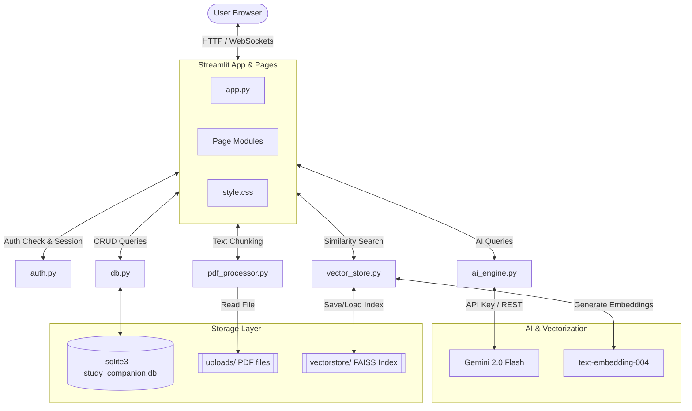

# System Architecture

The AI Study Companion architecture is structured into four main layers: Frontend Presentation (Streamlit), Application Logic, Vector Storage/AI Integration, and the Database Storage layer.

## Description of Components
1. **Frontend Presentation**: Standard Streamlit multipage setup utilizing navigation routines, custom stylesheets (`style.css`), and Plotly visualization libraries.
2. **Application Logic**: Modular Python utility modules implementing core flows (auth logic, PDF preprocessing, RAG searches, and Gemini prompt constructions).
3. **AI & Vector Integration**: Utilizes Google Gen AI SDK for generating text completions and embedding structures. Searches are stored and computed locally using FAISS.
4. **Data Storage**: SQLite handles local relational tables (users, quiz results, study plans, metadata). Original PDFs are held securely in the system folder structures.
