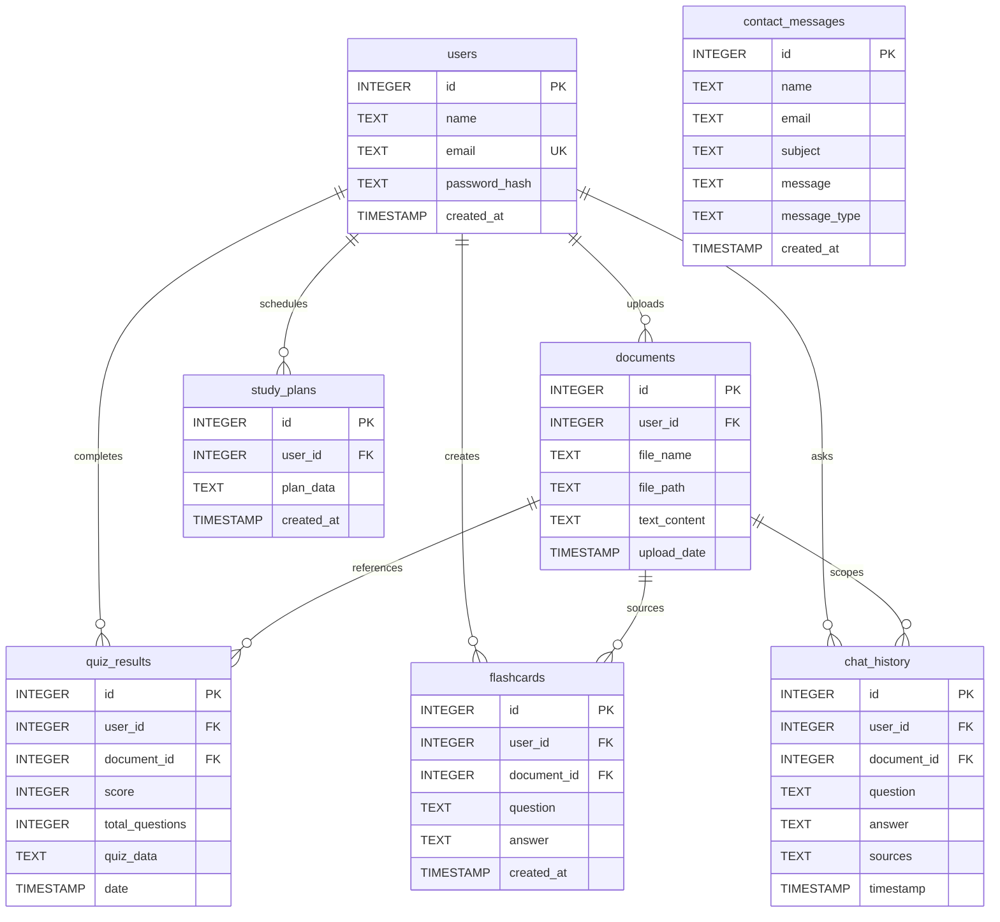

# Database ER Diagram

The AI Study Companion uses a local SQLite database with the following entity relationships.

```mermaid
erDiagram
    users {
        INTEGER id PK
        TEXT name
        TEXT email UK
        TEXT password_hash
        TIMESTAMP created_at
    }

    documents {
        INTEGER id PK
        INTEGER user_id FK
        TEXT file_name
        TEXT file_path
        TEXT text_content
        TIMESTAMP upload_date
    }

    quiz_results {
        INTEGER id PK
        INTEGER user_id FK
        INTEGER document_id FK
        INTEGER score
        INTEGER total_questions
        TEXT quiz_data
        TIMESTAMP date
    }

    flashcards {
        INTEGER id PK
        INTEGER user_id FK
        INTEGER document_id FK
        TEXT question
        TEXT answer
        TIMESTAMP created_at
    }

    study_plans {
        INTEGER id PK
        INTEGER user_id FK
        TEXT plan_data
        TIMESTAMP created_at
    }

    chat_history {
        INTEGER id PK
        INTEGER user_id FK
        INTEGER document_id FK
        TEXT question
        TEXT answer
        TEXT sources
        TIMESTAMP timestamp
    }

    contact_messages {
        INTEGER id PK
        TEXT name
        TEXT email
        TEXT subject
        TEXT message
        TEXT message_type
        TIMESTAMP created_at
    }

    users ||--o{ documents : "uploads"
    users ||--o{ quiz_results : "completes"
    users ||--o{ flashcards : "creates"
    users ||--o{ study_plans : "schedules"
    users ||--o{ chat_history : "asks"
    
    documents ||--o{ quiz_results : "references"
    documents ||--o{ flashcards : "sources"
    documents ||--o{ chat_history : "scopes"
```
