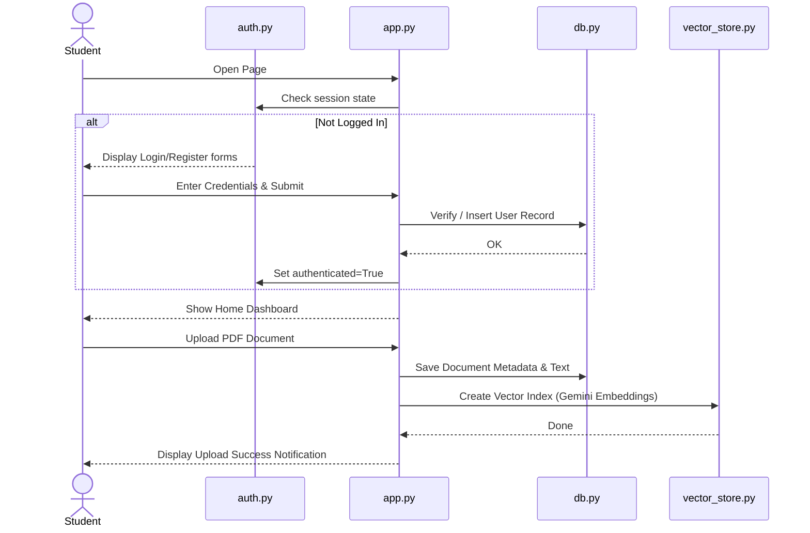
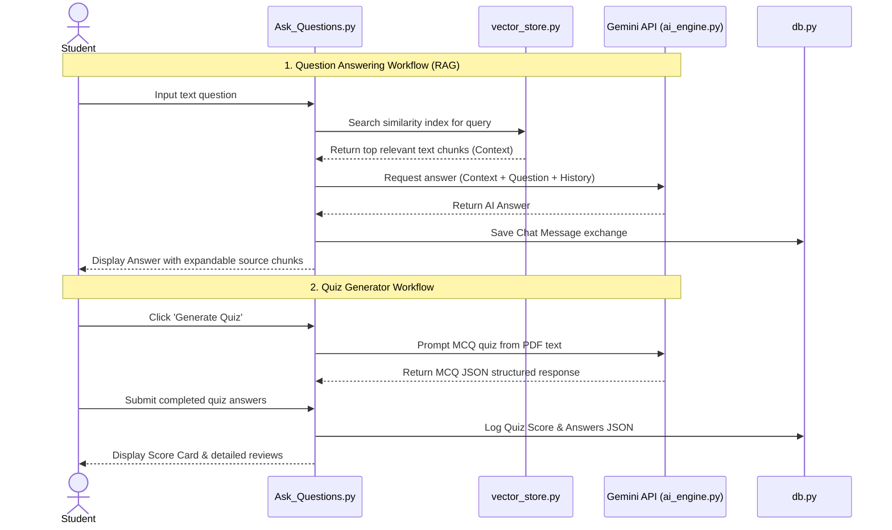

# Workflow Diagram

This document illustrates the primary workflow pathways available within the AI Study Companion.

## 1. User Authentication & Upload Workflow

## 2. RAG Q&A & Quiz Generation Workflows

